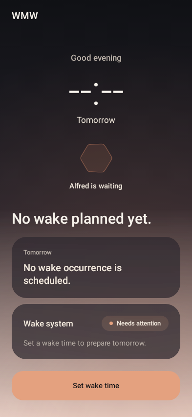
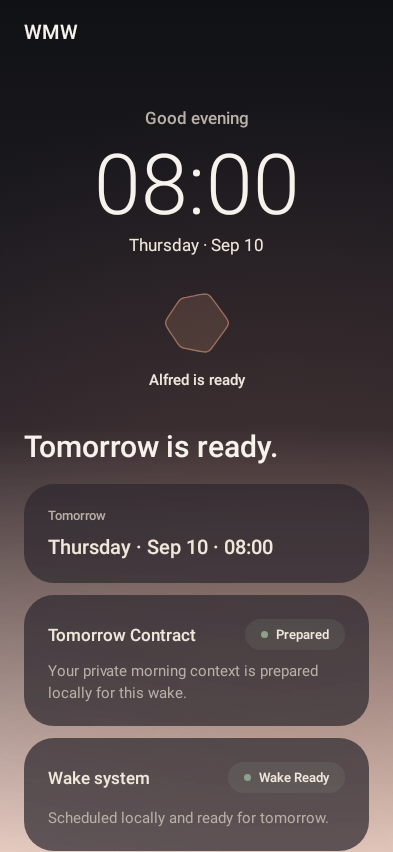
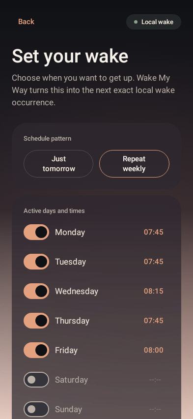
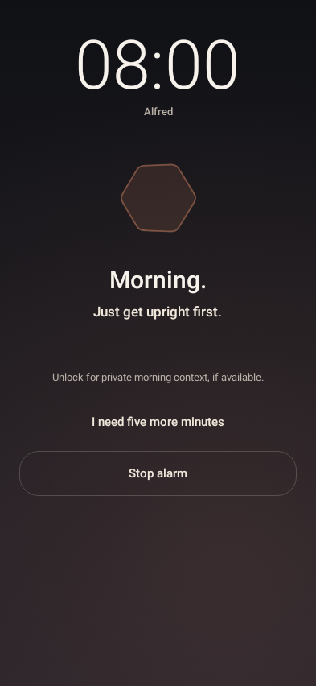

<div align="center">

# Wake My Way

### Wake up your way.

**A local-first conversational alarm for Android that does more than make noise. It helps you move from sleep inertia into action, then learns which wake strategy works best for you.**

[](https://github.com/yotamon/WakeMyWay/actions/workflows/android-ci.yml)
[](https://github.com/yotamon/WakeMyWay/actions/workflows/android-device-tests.yml)
[](https://github.com/yotamon/WakeMyWay/actions/workflows/android-visual-regression.yml)


[Product vision](docs/01-product-vision.md) · [Architecture](docs/08-android-architecture.md) · [Project status](docs/00-project-status.md) · [Roadmap](docs/21-roadmap-implementation-plan.md)

</div>

---

## An alarm that learns how to wake *you*

Traditional alarms know **when** to make noise. Wake My Way is built around a different question:

> **What is the least aggressive, most effective sequence that gets this person genuinely moving?**

Different mornings need different interventions. Sometimes sound is enough. Sometimes a short conversation, a request to sit up, a movement cue, or context about tomorrow is what breaks sleep inertia.

Wake My Way combines a reliability-first native Android alarm with a deterministic behavioral runtime, local voice interaction, physical activation evidence, private night-before context, and explainable local learning.

It is deliberately narrow. It is **not** a general productivity assistant, sleep tracker, or AI companion.

> **I set an alarm because I genuinely want to get moving at this time. Help me succeed.**

## The product today

<table>
  <tr>
    <td width="25%" align="center"></td>
    <td width="25%" align="center"></td>
    <td width="25%" align="center"></td>
    <td width="25%" align="center"></td>
  </tr>
  <tr>
    <td align="center"><sub>Tonight</sub></td>
    <td align="center"><sub>Wake ready</sub></td>
    <td align="center"><sub>Schedule setup</sub></td>
    <td align="center"><sub>Active wake</sub></td>
  </tr>
</table>

Wake My Way is currently a **real local-first conversational Android wake product in founder dogfood form**.

The production morning path already connects the alarm kernel, deterministic Wake Runtime, Alfred's local speech, on-device voice replies, and motion evidence. The next trust gate is measured physical-device reliability across locked screens, Doze, OEM power management, audio routing, Bluetooth, local TTS and on-device recognition.

| Capability | State |
| --- | --- |
| Native exact alarm + Direct Boot recovery | ✅ Implemented |
| Durable foreground Active Wake Execution | ✅ Implemented |
| Deterministic Wake Runtime | ✅ Implemented |
| Motion evidence | ✅ Implemented |
| Alfred local character + offline TTS | ✅ Production-connected |
| On-device spoken replies | ✅ Production-connected |
| Tomorrow Contract + prepared wake plan | ✅ Production-connected |
| Deterministic Wake Learning v0 | ✅ Core merged, live journal/application wiring still open |
| Realtime conversational voice | 🧪 Experimental measurement track only |
| Physical overnight reliability proof | 🔬 Next validation gate |

The living source of truth is [`docs/00-project-status.md`](docs/00-project-status.md).

## The hard rule

> ### Intelligence may fail. The alarm may not.

The critical wake path is intentionally independent from AI, network access, microphone permission, motion sensors, personalization, cloud services, and even the lifetime of the wake UI.

```text
Wake Schedule
      ↓
Alarm Kernel
      ↓
Critical Wake Snapshot
      ↓
AlarmManager.setAlarmClock()
      ↓
AlarmReceiver
      ↓
AlarmPlaybackService
      ├─ critical local audio
      ├─ notification / full-screen intent
      └─ durable Stop / Snooze
```

Only after critical local alarm delivery starts does the adaptive wake experience join the session:

```text
WakeActivity
      ↓
WakeVoiceSessionController
      ↓
WakeRuntime
      ├─ Speak(InitialWake)
      ├─ Speak(AskToSitUp)
      ├─ ListenForVoiceResponse
      ├─ ObserveMotion
      ├─ Speak(AskToMove / ReEngage)
      └─ PresentOrientation / CompleteSession
```

**AI may express wake behavior. It never owns wake behavior.** The pure-Kotlin Wake Runtime remains the only in-session behavioral authority.

## What makes Wake My Way interesting

### 🛡️ Reliability-first alarm architecture

The Deep Alarm Kernel owns exact scheduling and active wake execution, including Direct-Boot-aware recovery, foreground playback, stale-trigger rejection, durable stop/snooze behavior, and reconciliation after device state changes.

### 🧠 Deterministic behavioral runtime

Wake behavior is modeled as a replayable state machine rather than a pile of UI callbacks:

```text
ALERTING → ENGAGING → ACTIVATING → ORIENTING → FINISHED
```

Typed `WakeInput` facts enter the runtime. Typed `WakeDirective` decisions come out. Android adapters execute those decisions and report facts back.

### 🗣️ Local conversational wake

Alfred can speak using a verified offline Android TTS voice and listen using Android's on-device speech recognizer. When both capabilities are healthy, motion alone cannot silently finish the wake sequence: at least one coherent spoken reply is required before orientation.

The microphone path does **not** persist raw audio or recognized transcript text. The release Android baseline also does not require `INTERNET` permission for local voice.

### 📱 Physical activation evidence

Wake My Way extracts bounded evidence such as device pickup, orientation change, and sustained movement. Raw high-frequency sensor streams are not persisted.

The goal is not to pretend the app can biologically prove wakefulness. It observes meaningful activation signals and keeps those claims calibrated.

### 🌅 Adaptive Dawn design system

The product uses a purpose-built Compose visual system designed for the unusual context of half-awake interaction: low cognitive load, clear hierarchy, gentle presence, explicit state, and strong critical actions.

Reviewed product states are protected with curated Roborazzi visual regression.

### 🔁 Explainable local learning

Wake Learning v0 is deterministic, bounded, versioned, reversible, and local-first. It is designed to adapt strategy without silently mutating an active wake session or becoming a dependency for alarm delivery.

## Architecture in one picture

```text
                         WAKE MY WAY

  Reliability authority                    Behavioral authority
  ─────────────────────                    ────────────────────

  Wake Schedule                            platform + user facts
       │                                          │
       ▼                                          ▼
  Alarm Kernel                              typed WakeInput
       │                                          │
       ▼                                          ▼
  Critical Wake Snapshot                    WakeRuntime
       │                                          │
       ▼                                          ▼
  Android AlarmManager                     typed WakeDirective
       │                                          │
       ▼                                          ▼
  AlarmPlaybackService                     Android adapters
       │                                      │    │    │
       │                                      │    │    └─ motion
       │                                      │    └────── local voice input
       │                                      └─────────── Alfred / local TTS
       │
       └──── critical audio stays authoritative
```

The separation is intentional: adaptive behavior can degrade without weakening the alarm's critical execution boundary.

## Technology

| Area | Stack |
| --- | --- |
| Android app | Kotlin 2.4.20 · Jetpack Compose · Navigation 3 · Android AlarmManager · Direct Boot |
| Wake behavior | Pure Kotlin deterministic runtime · local preparation · motion evidence · local learning |
| Voice | Android TextToSpeech · on-device SpeechRecognizer · bounded alarm/voice coexistence |
| Quality | JUnit · Android instrumentation · API-36 reliability lane · Roborazzi visual regression · GitHub Actions |
| Experimental cloud | TypeScript · Vercel · provider-neutral AI/voice measurement harness |

**Android toolchain:** JDK 17 · Gradle 9.6.1 · Android Gradle Plugin 9.4.0 · `compileSdk = 37` · `targetSdk = 36` · `minSdk = 29`

## Repository shape

```text
WakeMyWay/
├── apps/
│   ├── android/
│   │   ├── app/          # Compose UI, Alarm Kernel, platform adapters, production wake path
│   │   ├── wake-core/    # pure Kotlin runtime, schedule, motion, character, learning, preparation
│   │   └── benchmark/    # startup / wake-path performance host
│   └── cloud/            # non-critical AI and realtime measurement infrastructure
├── docs/
│   ├── adr/              # durable architecture decisions
│   ├── implementation/   # implementation notes and evidence boundaries
│   └── research/         # platform, psychology and competitor research
├── tooling/
├── AGENTS.md             # engineering rules for humans and coding agents
├── CONTEXT.md            # canonical domain vocabulary and invariants
└── README.md
```

## Build locally

```bash
cd apps/android
./gradlew test lint assembleDebug
```

The project intentionally keeps the trust-critical Android path local. Cloud capabilities live outside alarm authority and can be unavailable without preventing the device from waking the user.

## Start reading here

| If you care about... | Read... |
| --- | --- |
| What is actually implemented today | [`docs/00-project-status.md`](docs/00-project-status.md) |
| Product thesis and scope | [`docs/01-product-vision.md`](docs/01-product-vision.md) |
| UX and behavioral rationale | [`docs/04-ux-psychology.md`](docs/04-ux-psychology.md) |
| Android architecture | [`docs/08-android-architecture.md`](docs/08-android-architecture.md) |
| Critical alarm reliability | [`docs/10-alarm-kernel.md`](docs/10-alarm-kernel.md) |
| Wake state machine | [`docs/11-wake-runtime-state-machine.md`](docs/11-wake-runtime-state-machine.md) |
| Voice and character architecture | [`docs/13-ai-voice-character-system.md`](docs/13-ai-voice-character-system.md) |
| Learning strategy | [`docs/14-wake-strategy-learning.md`](docs/14-wake-strategy-learning.md) |
| Privacy and security | [`docs/16-privacy-security.md`](docs/16-privacy-security.md) |
| Evidence-driven roadmap | [`docs/21-roadmap-implementation-plan.md`](docs/21-roadmap-implementation-plan.md) |

For the full documentation map, see [`docs/README.md`](docs/README.md).

<details>
<summary><strong>Non-negotiable engineering principles</strong></summary>

1. **Android is our first client, not our product architecture.**
2. **Intelligence may fail. The alarm may not, inside the documented platform reliability envelope.**
3. **Alarm reliability continues after the OS trigger; critical playback must survive ordinary UI lifecycle churn.**
4. **AI expresses wake behavior. It never owns wake behavior.**
5. **Critical wake behavior and initial learning are local-first.**
6. **Deep modules beat forests of speculative interfaces.**
7. **Behavioral activation is observable; biological wakefulness is not claimed.**
8. **Activation Completion is not circular proof of real Wake Success.**
9. **User dignity and agency are product requirements.**

</details>

## Reliability truth

Wake My Way is intentionally conservative about reliability claims.

Automated tests can prove deterministic behavior, integration compatibility, timing evidence and emulator coverage. They **cannot** prove the real overnight experience across locked screens, Doze, reboot-before-unlock, OEM power management, Bluetooth routing, local TTS/STT availability, or every physical device.

That physical evidence is the current next gate before broader reliability claims.

## Project discipline

Documentation is project memory, not aspirational marketing. Changes distinguish **Decided**, **Planned**, **Implemented**, **Tested**, and **Hypothesis**.

Canonical terminology lives in [`CONTEXT.md`](CONTEXT.md). Durable decisions live in [`docs/adr/`](docs/adr/). Current implementation truth lives in [`docs/00-project-status.md`](docs/00-project-status.md).

---

<div align="center">

**Wake My Way** · **WMW** · *Wake up your way.*

Built around one promise: **help the user get moving without making intelligence a reliability dependency.**

</div>
